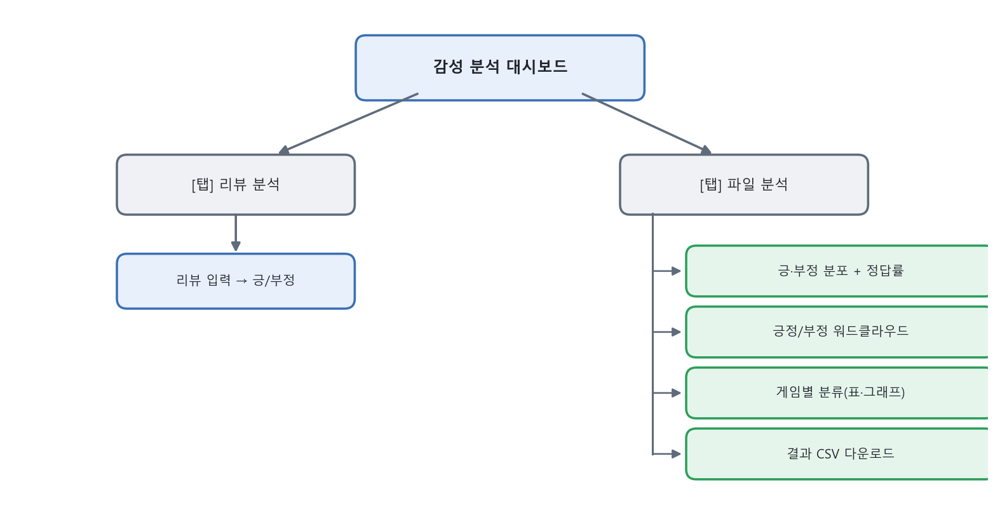
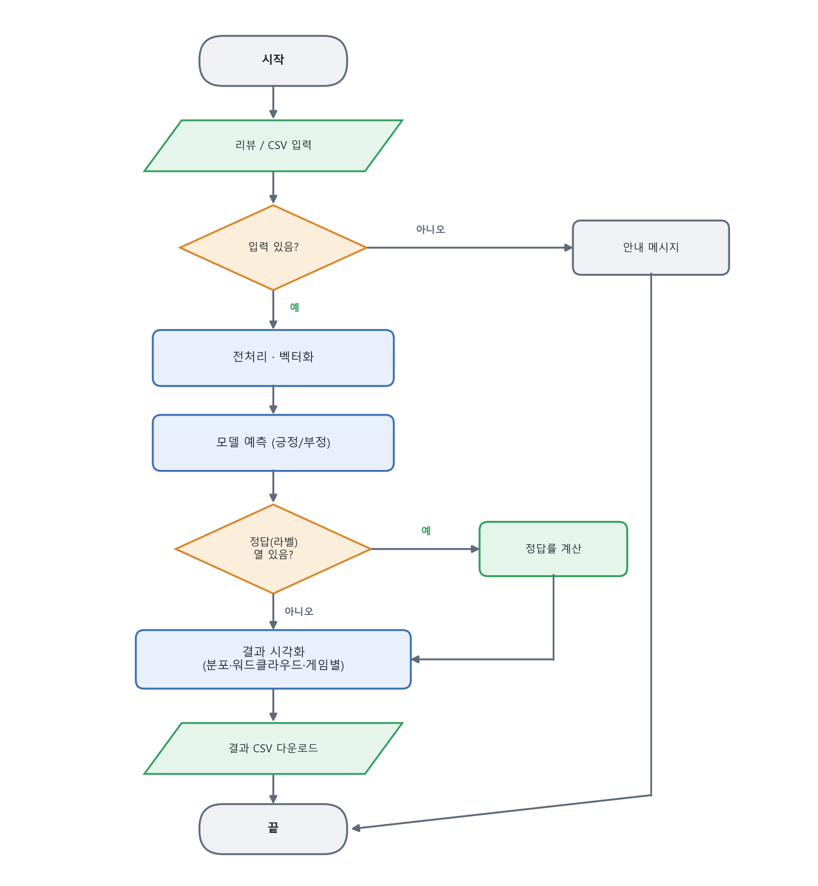
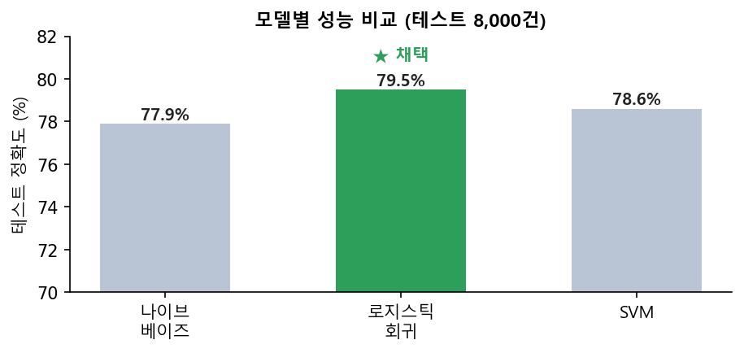

# Technical Report — Steam 게임 리뷰 감성 분석 서비스

---

## 1. 프로젝트 개요

### 1.1 프로젝트 주제
Steam 게임 리뷰를 수집·전처리하고, 머신러닝으로 리뷰의 **긍정/부정을 자동 분류**하는 서비스.
학습한 모델을 **Streamlit 웹 대시보드**로 배포하여, 리뷰 감성 분류·게임별 분석·긍정/부정 키워드 워드클라우드를 제공한다.

### 1.2 프로젝트 선정 이유
- 인기 게임 하나에도 리뷰가 **수만 개** 쌓여, 사람이 일일이 읽고 판단하기 어렵다.
- 리뷰의 긍정/부정을 자동으로 분류하면, 게임의 반응을 **한눈에** 파악할 수 있다.
- 텍스트 수집(크롤링) → 전처리 → 머신러닝 분류 → 웹 배포까지 **텍스트 마이닝 전 과정**을 직접 경험하기에 적합한 주제다.

### 1.3 개발 환경
| 구분 | 내용 |
|------|------|
| 사용 언어 | Python 3.x |
| 개발 도구 | Visual Studio Code, Anaconda(가상환경) |
| 주요 라이브러리 | requests, deep-translator(수집) / konlpy(Okt), scikit-learn(학습) / Streamlit, matplotlib, wordcloud(시각화) |
| 형태소 분석 | konlpy Okt (Java(JDK) 필요) |
| 실행 방식 | 로컬: `streamlit run` (또는 `run.bat`) / 배포: Streamlit Community Cloud |

---

## 2. 서비스 개요

### 2.1 서비스 설명
- **핵심 기능**: 게임 리뷰 텍스트를 입력하면 **긍정/부정**을 분류하고 확신도를 제시한다. CSV 파일을 올리면 다수 리뷰를 **일괄 분류**하고, **게임별** 긍·부정 비율과 **키워드 워드클라우드**를 보여준다.
- **주요 사용자 / 사용 상황**
  - 게이머: 특정 게임의 전반적 반응(호평/혹평)을 빠르게 파악.
  - 게임 개발사/기획자: 리뷰 여론과 부정 키워드(버그, 최적화 등)를 모니터링.
  - 데이터 분석 학습자: 한국어 감성 분석 파이프라인 예제로 활용.

> **페르소나(예시)**
> - *김게이머(25)*: 신작 구매 전 "이 게임 평이 좋나?"를 30초 안에 확인하고 싶다.
> - *박기획(32)*: 자사 게임 리뷰에서 부정 반응의 원인 키워드를 뽑아 개선 우선순위를 정하고 싶다.

> **유사 서비스 벤치마킹**
> | 서비스 | 특징 | 본 프로젝트와의 차이 |
> |--------|------|----------------------|
> | Steam 리뷰 요약(추천/비추천 %) | 단순 집계 | 문장 단위 감성 분류 + 키워드 시각화 제공 |
> | Metacritic/OpenCritic | 전문가 평점 중심 | 실제 **유저 리뷰** 텍스트 기반 |

### 2.2 주요 기능

**Usecase Diagram**

*그림 2-1. 일반 사용자는 대시보드에서 분류·분석·다운로드를, 관리자(개발자)는 수집·전처리·학습을 수행한다.*

**기능별 설명**
| 기능 | 설명 |
|------|------|
| 리뷰 한 건 분석 | 입력 리뷰 → 긍정/부정 + 확신도(%) |
| CSV 일괄 분석 | 다수 리뷰 분류 → 긍·부정 분포, (정답 있을 시) 정답률 |
| 게임별 분석 | 게임별 리뷰수·긍정·부정·긍정률 표 + 상위 게임 막대그래프 |
| 워드클라우드 | 긍정/부정 리뷰의 핵심 키워드 시각화(초록/빨강) |
| 결과 다운로드 | 분류 결과 CSV 저장 |

**사용자 유형 설명**
- **일반 사용자**: 웹 대시보드로 분석 기능만 이용(설치·학습 지식 불필요).
- **관리자(개발자)**: 크롤러·전처리·학습 스크립트로 데이터/모델을 갱신.

### 2.3 메뉴 구성도

*그림 2-2. 화면은 '리뷰 분석'·'파일 분석' 2개 탭으로 구성되며, 파일 분석 탭에서 분포·워드클라우드·게임별 분류·다운로드를 제공한다.*

### 2.4 User Flow (End-to-End 시나리오)

*그림 2-3. 단건·일괄 두 시나리오 모두 "입력 → 모델 예측 → 결과 시각화" 흐름을 따른다.*

---

## 3. 요구사항 정의

### 3.1 기능 요구사항
| ID | 요구사항 |
|----|----------|
| FR-1 | Steam 리뷰를 장르별로 수집한다. |
| FR-2 | 수집 데이터를 정제·라벨링하고 클래스 균형을 맞춘다. |
| FR-3 | 리뷰를 긍정/부정으로 분류하는 모델을 학습·저장한다. |
| FR-4 | 리뷰 한 건을 입력받아 긍정/부정과 확신도를 출력한다. |
| FR-5 | CSV의 다수 리뷰를 일괄 분류하고 분포를 시각화한다. |
| FR-6 | 게임별 긍·부정 비율을 집계·시각화한다. |
| FR-7 | 긍정/부정 키워드 워드클라우드를 생성한다. |
| FR-8 | 분석 결과를 CSV로 내려받는다. |

### 3.2 비기능 요구사항
| ID | 구분 | 요구사항 |
|----|------|----------|
| NFR-1 | 성능 | 형태소 분석기(Okt)를 1회만 로딩·캐싱하여 반복 분석 속도를 확보한다. |
| NFR-2 | 사용성 | 다크 테마 UI, 긍정=초록/부정=빨강으로 직관적 구분. |
| NFR-3 | 이식성 | 한글 폰트를 OS별 자동 탐색(Windows/Linux), 클라우드 배포 지원. |
| NFR-4 | 보안 | 외부 API 키를 코드에 하드코딩하지 않고 환경변수로 관리. |
| NFR-5 | 재현성 | 벡터라이저·모델을 파일(.pkl)로 저장하여 동일 결과 재현. |
| NFR-6 | 안정성 | 대량 형태소 분석 시 JVM 힙을 조정해 메모리 오류를 방지. |

---

## 4. 아키텍처 설계

### 4.1 시스템 구성도

*그림 4-1. 수집 → 전처리 → 학습 → 배포의 단방향 파이프라인. 각 단계 산출물은 파일로 저장되어 다음 단계 입력이 된다.*

### 4.2 프로젝트 파일 구조 *(그림 4-2)*
```
Steam감성분석_제출/
├── 1_소스코드_및_데이터/          # 크롤러(수집)
│   ├── steam/                     # Steam 리뷰 크롤러(최종 사용)
│   ├── opencritic/                # OpenCritic 크롤러(초기 시도)
│   └── data/opencritic_reviews_final.jsonl
├── 2_실행파일_데이터_모델/
│   ├── data/steam_sentiment.csv   # 학습 데이터
│   ├── model/*.pkl                # 학습된 모델
│   ├── 학습코드/                  # 전처리·학습 + mylib
│   ├── 스트림릿/                  # 대시보드 앱 + mylib
│   └── run.bat, requirements.txt, packages.txt
└── 3_문서/                        # 기술문서·발표자료·시연영상
```

### 4.3 데이터 구조 (ERD 대체)
> 본 프로젝트는 관계형 DB를 사용하지 않고 **파일(JSONL/CSV)** 로 데이터를 관리하므로,
> ERD 대신 데이터 스키마를 기술한다. *(그림 4-3)*

**수집 데이터 (JSONL, 1 리뷰 = 1 라인)**
```json
{"게임 이름": "...", "작성자": "...", "리뷰 내용": "...", "평점": "추천/비추천"}
```
**학습 데이터 (CSV)**
| 컬럼 | 타입 | 설명 |
|------|------|------|
| review | text | 리뷰 본문(정제됨) |
| label | int(0/1) | 0=부정, 1=긍정 |
| game | text | 게임 이름 |
| genre | text | 장르 |

*설명: 수집 JSONL의 '평점'이 학습 CSV의 label(추천→1/비추천→0)로 변환된다.*

---

## 5. 주요 기술
| 기술 | 사용 목적 |
|------|-----------|
| **Steam appreviews API** | 장르별 유저 리뷰 대량 수집(라운드 로빈, 이어받기) |
| **deep-translator** | 외국어 리뷰 한국어 번역 |
| **konlpy Okt** | 한국어 형태소 분석(명사·형용사·동사·부사 추출, 원형 복원) |
| **부정어 처리(NEG_)** | '안/못/없다/별로' 뒤 단어에 표시 → 반어·부정 표현 학습 |
| **TF-IDF (1–2그램)** | 단어·구절 중요도 벡터화('안 좋다', '재미 없다' 등 포착) |
| **로지스틱 회귀** | 긍정/부정 이진 분류 모델 |
| **joblib** | 벡터라이저·모델 저장/로딩(.pkl) |
| **Streamlit** | 웹 대시보드 UI |
| **wordcloud / matplotlib** | 키워드 워드클라우드·그래프 시각화 |

---

## 6. 테스트 결과

### 6.1 테스트 계획
| 항목 | 조건 | 기대 결과 |
|------|------|-----------|
| 단건 분류 정확성 | 명확한 긍/부정 문장 입력 | 올바른 라벨 + 높은 확신도 |
| 일괄 분류 | 라벨 포함 CSV 입력 | 정답률 산출(약 79% 수준) |
| 게임별 분석 | game 컬럼 포함 데이터 | 게임별 긍·부정 집계 표/그래프 |
| 반어·부정 처리 | "안 좋다", "재미없다" 등 | 부정으로 분류 |
| 예외 처리 | 빈 입력·파일 없음·모델 없음 | 경고/안내 메시지, 미충돌 |

### 6.2 테스트 케이스
| # | 입력 | 기대 | 결과 |
|---|------|------|------|
| T1 | "정말 재미있고 시간 가는 줄 몰랐어요" | 긍정 | 긍정(약 96%) ✅ |
| T2 | "최악의 게임 환불하고 싶다" | 부정 | 부정(약 99%) ✅ |
| T3 | "그래픽은 좋은데 최적화가 너무 별로" | 부정 | 부정 ✅ |
| T4 | "안 재밌다" | 부정 | 토큰: ['안','NEG_재밌다'] → 부정 ✅ |
| T5 | steam_sentiment.csv 300건 일괄 | 정답률 표시 | 약 79% ✅ |
| T6 | 빈 리뷰로 [분석하기] | 경고 | "리뷰를 입력해 주세요" ✅ |


*그림 6-1. 세 모델 중 로지스틱 회귀가 테스트 정확도 79.5%로 가장 높아 최종 채택하였다. (대시보드 실행 화면은 발표자료·시연영상 참조)*

### 6.3 오류 처리 결과
| 상황 | 처리 |
|------|------|
| 모델 파일 없음 | 오류 메시지 + 학습 안내 후 실행 중단 |
| 한글 폰트 미탐지 | 대체 폰트로 동작(워드클라우드 크래시 방지) |
| 대량 형태소 분석 시 JVM OutOfMemory | `KONLPY_HEAP_MB` 환경변수로 힙 확대 |
| 번역 실패(API 차단) | 원문 유지(데이터 유실 방지) |

---

## 7. 프로젝트 결과 분석

### 7.1 구현 완료 기능
- Steam/OpenCritic 크롤러, 데이터 전처리(정제·라벨링·균형 샘플링)
- 감성 분류 모델 학습·저장 (Okt + 부정어 처리 + TF-IDF 1–2그램 + 로지스틱 회귀)
- 대시보드: 단건 분류, 일괄 분류, **게임별 분석**, 긍정/부정 워드클라우드, 결과 다운로드
- 다크 테마 UI, 폰트 자동 탐색, 클라우드 배포 준비(packages.txt)

### 7.2 구현하지 못한 기능
- 딥러닝(LSTM 등) 기반 문맥 이해
- 별점 세분화(다중 분류)
- 완전한 반어(비꼼) 인식
- 실시간 리뷰 수집 연동

### 7.3 어려웠던 점과 해결 방법
| 어려움 | 해결 |
|--------|------|
| OpenCritic 무료 API의 데이터 제공량 한정 | Steam 공개 리뷰로 전환(대량 확보) |
| 여러 주제 순차 수집 시 인기 주제에 치우침 | 라운드 로빈(주제당 N개씩 교대 수집) |
| 대량 형태소 분석 중 JVM 메모리 오류 | JVM 힙 크기 환경변수 조정 |
| 번역체·반어 표현 오분류 | 부정어 표시(NEG_) + 2그램 특징 도입 |
| (일정 문제) 자체 수집 데이터 부족 | 같은 주제를 조사한 동료의 데이터로 학습 |

---

## 8. 학습 성과

### 8.1 새롭게 배우거나 성장한 부분
이번 프로젝트에서 한국어 텍스트를 다루는 과정을 처음부터 끝까지 직접 해볼 수 있었다. 특히 형태소 분석기(Okt)로 문장을 단어 단위로 나누고, 이를 TF-IDF로 수치화해 모델에 넣는 전체 흐름을 이해하게 된 것이 가장 큰 수확이었다. 처음에는 "안 좋다"와 "좋다"를 같은 것으로 인식하는 문제가 있었는데, 부정어를 따로 표시해 주는 방법을 적용하면서 전처리와 특징 설계가 결과에 얼마나 큰 영향을 주는지도 체감했다. 또 Streamlit을 처음 써봤는데, 학습시킨 모델을 짧은 코드로 웹 화면으로 만들 수 있다는 점이 인상 깊었다.

### 8.2 아쉬운 부분과 개선 방향
데이터 수집을 조금만 더 일찍 시작했다면 직접 모은 데이터로 학습할 수 있었을 텐데 그러지 못한 점이 아쉬웠다. 그리고 "와 진짜 재밌겠다(비꼼)" 같은 반어 표현은 아직도 잘 맞히지 못하는데, 다음에는 문맥을 이해하는 딥러닝 모델(LSTM 등)을 적용해 개선해 보고 싶다.

---

## 부록. 실행 방법

**준비물**: Python 3.x (Anaconda 권장), **Java(JDK)** — 한글 형태소 분석(konlpy)에 필요.

### A.1 대시보드 바로 실행 (학습된 모델 사용 — 가장 빠름)
학습된 모델이 포함되어 있어 아래만으로 바로 동작한다.
```
cd 2_실행파일_데이터_모델
pip install -r requirements.txt
run.bat            (또는  cd 스트림릿  →  streamlit run SteamSAWebDashboard.py)
```
실행되면 브라우저에 `http://localhost:8501` 이 열린다.

### A.2 전체 파이프라인 재현 (선택)
| 단계 | 위치 | 명령 |
|------|------|------|
| ① 리뷰 수집 (Steam) | `1_소스코드_및_데이터/steam` | `python steam_review_crawler.py` |
| ① 리뷰 수집 (OpenCritic) | `1_소스코드_및_데이터/opencritic` | `set RAPIDAPI_KEY=발급키` → `python OpenCritic_WebCrawler.py` |
| ② 전처리 | `2_실행파일_데이터_모델/학습코드` | `python preprocess_sentiment_data.py` |
| ③ 모델 학습 | `2_실행파일_데이터_모델/학습코드` | `set KONLPY_HEAP_MB=4096` → `python train_sentiment_model.py` |
| ④ 대시보드 | `2_실행파일_데이터_모델/스트림릿` | `streamlit run SteamSAWebDashboard.py` |

> ②~③은 원본 대용량 리뷰 데이터가 필요하다(저장소 미포함). 이미 전처리된 `data/steam_sentiment.csv`와
> 학습된 `model/*.pkl`이 포함되어 있으므로, **그냥 실행만 하려면 A.1(또는 run.bat)만** 하면 된다.
