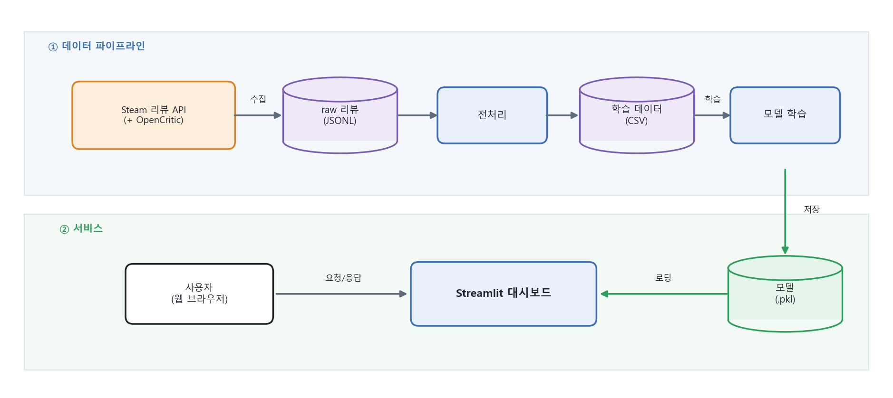
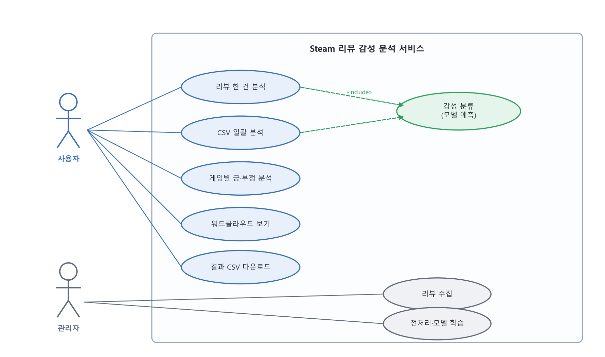

# 🎮 Steam 게임 리뷰 감성 분석

Steam 게임 리뷰를 수집·전처리하고, **머신러닝으로 긍정/부정을 자동 분류**하는 프로젝트입니다.
학습한 모델을 **Streamlit 웹 대시보드**로 만들어 리뷰 감성 분류·게임별 분석·키워드 워드클라우드를 제공합니다.

> ▶️ **시연 영상**: [YouTube](https://youtu.be/bcqwTPZ9qI0)  ·  📄 **상세 문서**: [Technical Report (PDF)](3_문서/Technical_Report/Technical_Report.pdf)

---

## ✨ 주요 기능
- **리뷰 한 건 분석** — 리뷰를 입력하면 긍정/부정 + 확신도(%)를 즉시 판정
- **CSV 일괄 분석** — 여러 리뷰를 한 번에 분류하고 긍·부정 분포·정답률 계산
- **게임별 분석** — 게임마다 긍정/부정 비율·긍정률을 표와 그래프로
- **워드클라우드** — 긍정/부정 리뷰의 핵심 키워드 시각화
- 다크 테마 UI · 결과 CSV 다운로드

---

**모델 성능 (테스트 8,000건)**


> 세 모델을 비교해 정확도가 가장 높은 **로지스틱 회귀(약 79%)** 를 채택했습니다.

---

## 🏗️ 시스템 아키텍처
수집 → 전처리 → 학습 → 배포로 이어지는 단방향 파이프라인입니다.



---

## 👥 유스케이스


## 🔄 사용자 흐름 (User Flow)


## 🧭 메뉴 구성


---

## ⚙️ 동작 원리

| 단계 | 설명 |
|------|------|
| **1. 수집** | Steam 공개 리뷰 API로 장르별 유저 리뷰 크롤링 (라운드 로빈·이어받기). 초기에는 OpenCritic을 썼으나 데이터 양이 적어 Steam으로 전환 |
| **2. 전처리** | BBCode·URL 제거, 잡음 필터 → 추천/비추천을 라벨(1/0)로 → 긍·부정 개수를 맞추는 **클래스 균형 샘플링** |
| **3. 학습** | Okt 형태소 분석(**부정어 처리**) + TF-IDF(**1–2그램**) → 로지스틱 회귀 학습 후 `.pkl` 저장 |
| **4. 배포** | 저장된 모델을 Streamlit 대시보드에서 불러와 실시간 분류 |

> 💡 **"안 좋다"와 "좋다"** 를 구분하기 위해, 부정어(안/못/없다/별로) 뒤 단어에 `NEG_` 표시를 붙이고
> 2-그램(구절) 특징을 더해 반어·부정 표현 분류를 개선했습니다.

---

## 🛠️ 기술 스택
| 분류 | 사용 기술 |
|------|-----------|
| 수집 | `requests`, `deep-translator` |
| 자연어 처리 | `konlpy`(Okt) |
| 머신러닝 | `scikit-learn`(TF-IDF, LogisticRegression) |
| 시각화·배포 | `Streamlit`, `matplotlib`, `wordcloud` |

---

## 📁 프로젝트 구조
```
├── 1_소스코드_및_데이터/     # 리뷰 수집 크롤러(steam·opencritic) + 수집 데이터
├── 2_실행파일_데이터_모델/   # 학습 데이터 · 학습 코드 · 모델 · Streamlit 앱
│   ├── data/  model/  학습코드/  스트림릿/
│   └── run.bat
└── 3_문서/                   # 기술문서(Technical Report) · 발표자료 · 시연영상
```

---

## ▶️ 실행 방법

> **준비물**: Python 3.x (Anaconda 권장) · **Java(JDK)** — 한글 형태소 분석(konlpy)에 필요

### ⭐ 가장 빠른 방법 — 대시보드 바로 실행
학습된 모델이 포함되어 있어 아래만으로 바로 동작합니다.
```cmd
cd 2_실행파일_데이터_모델
pip install -r requirements.txt
run.bat            REM 또는  cd 스트림릿  →  streamlit run SteamSAWebDashboard.py
```
실행되면 브라우저에 `http://localhost:8501` 이 열립니다.

### (선택) 처음부터 다시 만들기
| 단계 | 위치 | 명령 |
|------|------|------|
| ① 리뷰 수집 (Steam) | `1_소스코드_및_데이터/steam` | `python steam_review_crawler.py` |
| ① 리뷰 수집 (OpenCritic) | `1_소스코드_및_데이터/opencritic` | `set RAPIDAPI_KEY=발급키` → `python OpenCritic_WebCrawler.py` |
| ② 전처리 | `2_실행파일_데이터_모델/학습코드` | `python preprocess_sentiment_data.py` |
| ③ 모델 학습 | `2_실행파일_데이터_모델/학습코드` | `set KONLPY_HEAP_MB=4096` → `python train_sentiment_model.py` |
| ④ 대시보드 | `2_실행파일_데이터_모델/스트림릿` | `streamlit run SteamSAWebDashboard.py` |

> ②~③은 원본 대용량 리뷰 데이터가 필요합니다(저장소 미포함). 이미 전처리된 `data/steam_sentiment.csv`와
> 학습된 `model/*.pkl`이 있으므로, **그냥 실행만 하려면 ④(또는 run.bat)만** 하면 됩니다.

---

## ⚠️ 한계 및 향후 계획
- `"와 진짜 재밌겠다(비꼼)"` 같은 **완전한 반어(비꼼)** 는 아직 정확히 잡지 못함
- 추천/비추천 **이진 분류**만 지원 (별점 세분화 미구현)
- 향후: 딥러닝(LSTM 등) 문맥 이해, 별점 다중 분류, 실시간 수집 연동

---

## 💭 프로젝트를 마치며 (회고)

이번 프로젝트를 진행하면서 가장 크게 배운 점은, 모델을 만드는 것 자체보다 그것을 **실제로 동작하는 서비스로 완성하는 과정이 훨씬 더 어렵다**는 것이었습니다. 정확도를 높이는 일보다, 한글 형태소 분석기의 메모리 문제나 폰트 처리, 학습 환경과 실행 환경의 설정을 일치시키는 것처럼 눈에 잘 띄지 않는 부분에서 더 많은 시간과 고민이 필요했습니다.

데이터를 확보하는 일도 예상보다 쉽지 않았습니다. 처음에는 OpenCritic API를 사용했지만 확보할 수 있는 양이 부족하여 Steam으로 방향을 전환했고, 여러 주제를 함께 수집하는 과정에서도 시행착오를 거쳐 방식을 개선했습니다. 다만 일정을 여유 있게 잡지 못해 자체 수집 데이터가 부족했고, 그래서 같은 주제를 조사한 동료의 데이터를 활용해야 했던 점은 아쉬움으로 남습니다. 이 과정에서 **알고리즘 못지않게 '양질의 데이터를 어떻게 확보하느냐'가 프로젝트의 성패를 좌우한다**는 것을 체감했습니다.

특히 `"안 좋다"`를 부정으로 인식하지 못하던 문제를 부정 표현을 따로 처리하는 방식으로 개선하면서, **전처리와 특징 설계의 중요성**을 직접 확인할 수 있었습니다. 

앞으로 비슷한 프로젝트를 진행한다면 데이터 확보를 더 이른 단계에서 시작하고, 문맥을 이해할 수 있는 딥러닝 기반 모델까지 확장해 보고 싶습니다.

---

## 📌 참고
- 학습 데이터는 일정상 자체 수집분이 부족하여, 같은 주제를 조사한 동료의 데이터(약 260만 건)를 사용했습니다.
- 원본 대용량 수집본(약 800MB)은 저장소에서 제외했고, OpenCritic 수집 결과는 샘플 500건만 포함했습니다.
